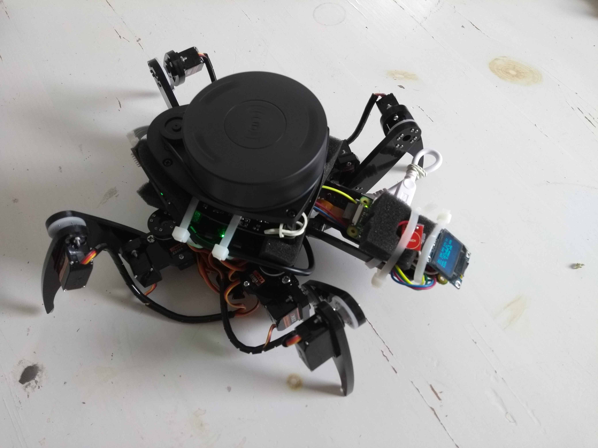

# SPDR_1

SPiDeR ONE - building an autonomous quadruped "drone" using SLAM to locate itself in an unknown environment.

Hardware:
  - Freenove Quadruped Robot Kit including acrylic parts, servos and the Arduino Mega Servo-Board. 100€
  - a Raspberry PI Zero W - 30€
  - RPI fisheye cam - 20€
  - SD-Card - i use 32GB - ?
  - SSD1306 OLED Display - 8€
  - RPLIDAR A1 - 100€
  - at least 2x (i use 4x+) 14500 750mAh Batteries - don't try to use standard batteries 
  - cables and some soldering tools
  
  - in my case i use cablebinder and rubberbands to "fix" the LIDAR and all the other parts on the chassis, BUT
  we will try to create a custom chassis for all this in a next part i guess :)
 
The Freenove Robot Kit is a perfect start for building up a small autonomous robot. We could make it much more easier by using
a wheel based bot, but i love this creepy spider-style when it crawles around. 

The Kit provides an Arduino Mega Controller Board which with Servo-Controllers onBoard. 
We will use this Board - as it is by default - as Controller-Board for all the body movement. 
We will modify/replace the Freenove Software to make our robot act much more natural and veeery creepy.

We will use diffenent types of software and programming languages when realizing all this:

  - the Arduino will be programmed using Processing and very simple C++ but with a lot of funny mathstuff
  - the Raspberry is programmed by some shell-skripts, python and ROS - ROS is a very very extensive "Toolset" which provides 
  solutions for quite complicate problems such as SLAM (simultanous locating and mapping) - in our case using a 360° LIDAR (light/laser based range detection) and a wide angle camera.
  
  
## Building it

First of all, build up the Freenove Robot Kit. Calibrate it and start playing with it. This will take you some time.. :)
..Welcome back. Now the custom part:

### Arduino Mega - The Bodymovement-Controller

While playing around you will have notived, that the bodymovements are nice but not very natural. and you cannot move/rotate the body while crawling around. that made me sad. we want to create a very natural-style creature which is able to move/rotate its body while moving around. So we need to modify the manufacturer's software-stack. 
The programs for Arduino Boards are commonly written in Arduino IDE / Processing Language, but the libraries it uses are written in c++. The standard-library here is FNQR, the Freenove Quaduped Robot Library.
You will find the Libary-files in <Arduino-Dir>/libaries/FNQR. 

I am currently modifying this stack. You will find the files in the ARDUINO/ folder of this repository.
Clone it and copy the SPDR_1 Folder in ARDUINO/ to your existing <Arduino-Dir>/Libaries folder, next to FNQR.

Now open the SPDR_1.ino file in ARDUINO/ with the Arduino IDE. Connect your bot and upload it.

Yay, our robot now has a "brain" for bodymovements. Now we need the "brain" to control all this and react on its environment.

### Raspberry - Let's connect the stuff

Download the ROSBots Raspberry Image and put it on the SD-Card. There are sooo many tutorials on how to do this, so i won't go into detail here.
The Rosbots Image already has ROS and OpenCV installed, which is very useful. You'll know if you ever tried to install ROS and OpenCV on a Raspberry by yourself ;)

https://github.com/ROSbots/rosbots_setup_tools#use-our-existing-rosbots-raspbianrosopencv-image-after-youve-downloaded-it
https://medium.com/@rosbots/ready-to-use-image-raspbian-stretch-ros-opencv-324d6f8dcd96

Let's connect the Raspberry PI Zero W to the Arduino Mega Board so the Raspberry can control it.
On the Freenove Arduino Mega Board we have a pinboard. We are interested in 5V, GND, RX3 and TX3. Put in some (4:)) cables and connect them
to your Raspberry PI:

5V to Raspberry 5V, GND to Raspberry GND, TX3 to Raspberry RX, RX3 to Raspberry TX

(include picture)

Connect to your Raspberry (how? -> google) and open up raspi-config to disable Console over Serial but leave Serial Hardware on - Advanced Settings somewhere
Otherwise you won't be able to communicate over the raspberry's serial (TX/RX) with the Arduino Board

Clone the repository to your Raspberry in users home folder.
then do a

sudo nano /etc/rc.local

and add

python /home/pi/SPDR_1/RASPBERRY/lidar_view.py

this will show up the data from the LIDAR on every start of the RPI.
  
  
